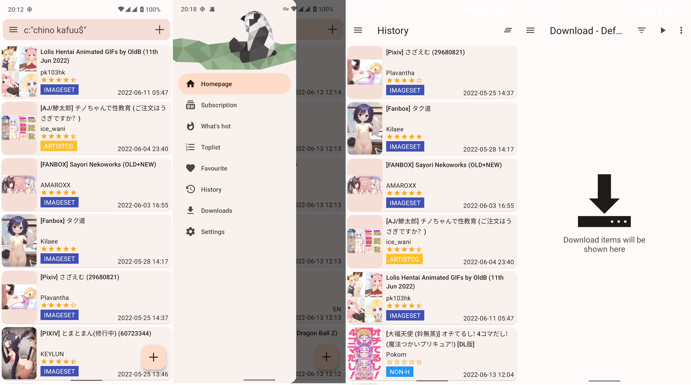

<h1 align="center">
  
   EhViewer 
</h1>

  
  
  
  
  

# Description

致力於輕量化與良好性能表現的 EhViewer 分支

已針對性適配 Material Design 3 及其動態取色系統

EhViewer fork dedicated to lightweight and high-performance

with Material Design 3 and Dynamic Color Support

# Download

 

App 分為 1.8 與 1.7 兩個版本。1.8 版本適配 Android 12 及以上系統，為開發主線；1.7 版本適配 Android 11 及以下版本，削減了 Android 12 及以上系統的獨有功能，使其能在低版本 Android 上正常工作

App is divided into two versions: 1.7 and 1.8 . Version 1.8 support Android 12 and above, also the develop mainline. Version 1.7 support Android 11 and below, drop down some spicetify functions for Android 12 to make app useable on lower Android System

# Screenshot

# Thanks

本項目受到了諸多開源項目的幫助

Here is the libraries

- [AOSP&AndroidX](http://source.android.com/)
- [android-advancedrecyclerview](https://github.com/h6ah4i/android-advancedrecyclerview)
- [FullDraggableDrawer](https://github.com/PureWriter/FullDraggableDrawer)
- [GnuTLS](https://gnutls.org/)
- [material-components-android](https://github.com/material-components/material-components-android)
- [material-design-icons](https://github.com/google/material-design-icons)
- [jsoup](https://github.com/jhy/jsoup)
- [okhttp](https://github.com/square/okhttp)
- [RikkaX](https://github.com/RikkaApps/RikkaX)
- [libarchive](http://www.libarchive.org/)
- [XZ Utils](https://tukaani.org/xz/)

# License

    Copyright 2014-2019 Hippo Seven
    Copyright 2020-2022 NekoInverter
    Copyright 2022 Tarsin Norbin

    EhViewer is free software: you can redistribute it and/or modify it under the terms of the GNU General Public License as published by the Free Software Foundation, either version 3 of the License, or (at your option) any later version.

    EhViewer is distributed in the hope that it will be useful, but WITHOUT ANY WARRANTY; without even the implied warranty of MERCHANTABILITY or FITNESS FOR A PARTICULAR PURPOSE. See the GNU General Public License for more details.

    You should have received a copy of the GNU General Public License along with EhViewer. If not, see <https://www.gnu.org/licenses/>.
