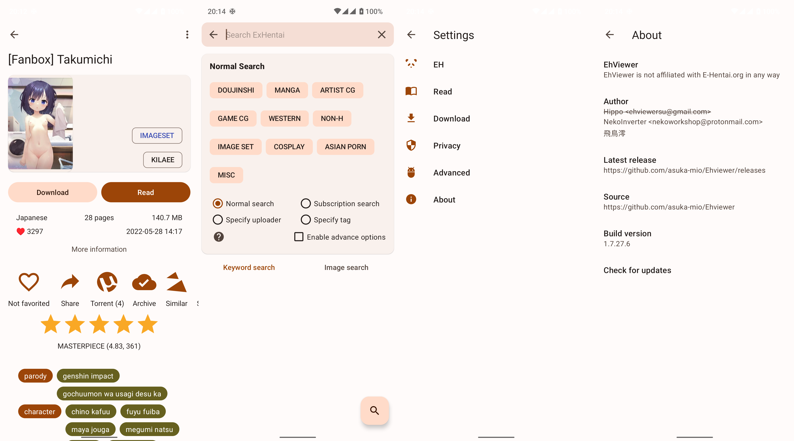

<h1 align="center">
  
   EhViewer 
</h1>

  
  
  
  
  

# Description

致力于轻量化与良好性能表现的 EhViewer 分支

已针对性适配 Material Design 3 及其动态取色系统

EhViewer fork dedicated to lightweight and high-performance

with Material Design 3 and Dynamic Color Support

# Download

[Github 下载](https://github.com/Ehviewer-Overhauled/Ehviewer/releases)

App 分为 1.8 与 1.7 两个版本。1.8 版本适配 Android 12 及以上系统，为开发主线；1.7 版本适配 Android 11 及以下版本，削减了 Android 12 及以上系统的独有功能，使其能在低版本 Android 上正常工作

App is divided into two versions: 1.7 and 1.8 . Version 1.8 support Android 12 and above, also the develop mainline. Version 1.7 support Android 11 and below, drop down some spicetify functions for Android 12 to make app useable on lower Android System

# Screenshot

# Thanks

本项目受到了诸多开源项目的帮助

Here is the libraries

- [AOSP](http://source.android.com/)
- [android-advancedrecyclerview](https://github.com/h6ah4i/android-advancedrecyclerview)
- [material-components-android](https://github.com/material-components/material-components-android)
- [material-design-icons](https://github.com/google/material-design-icons)
- [Apache Commons Lang](https://commons.apache.org/proper/commons-lang/)
- [apng](http://apng.sourceforge.net/)
- [giflib](http://giflib.sourceforge.net)
- [greenDAO](https://github.com/greenrobot/greenDAO)
- [jsoup](https://github.com/jhy/jsoup)
- [libjpeg-turbo](https://libjpeg-turbo.org/)
- [libpng](http://www.libpng.org/pub/png/libpng.html)
- [okhttp](https://github.com/square/okhttp)
- [roaster](https://github.com/forge/roaster)
- [TapTargetView](https://github.com/KeepSafe/TapTargetView)
- [libarchive](http://www.libarchive.org/)
- [XZ Utils](https://tukaani.org/xz/)

# License

    Copyright 2014-2019 Hippo Seven
    Copyright 2020-2022 NekoInverter
    Copyright 2022 Tarsin Norbin

    EhViewer is free software: you can redistribute it and/or modify it under the terms of the GNU General Public License as published by the Free Software Foundation, either version 3 of the License, or (at your option) any later version.

    EhViewer is distributed in the hope that it will be useful, but WITHOUT ANY WARRANTY; without even the implied warranty of MERCHANTABILITY or FITNESS FOR A PARTICULAR PURPOSE. See the GNU General Public License for more details.

    You should have received a copy of the GNU General Public License along with EhViewer. If not, see <https://www.gnu.org/licenses/>.
