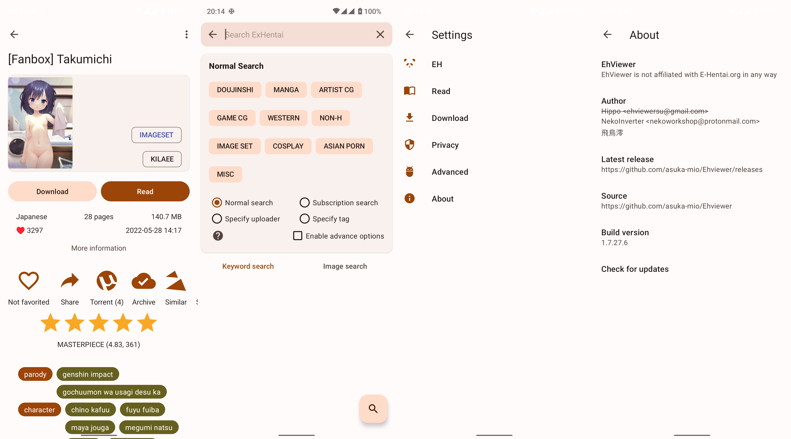

  <a href="https://github.com/Ehviewer-Overhauled/Ehviewer/blob/1.7.x.x/docs/README/en.md">
  English
  </a>
   | 
  <strong>简体中文<strong>
   | 
  <a href="https://github.com/Ehviewer-Overhauled/Ehviewer/blob/1.7.x.x/docs/README/zh-tw.md">
  正體中文
  </a>

<h1 align="center">
  
   EhViewer 
</h1>

  
  
  
  
  

  <h3>
    <a href="https://github.com/Ehviewer-Overhauled/Ehviewer/blob/1.7.x.x/docs/README/zh-cn.md#描述">
    描述
    </a>
     | 
    <a href="https://github.com/Ehviewer-Overhauled/Ehviewer/blob/1.7.x.x/docs/README/zh-cn.md#下载">
    下载
    </a>
     | 
    <a href="https://github.com/Ehviewer-Overhauled/Ehviewer/blob/1.7.x.x/docs/README/zh-cn.md#截图">
    截图
    </a>
     | 
    <a href="https://github.com/Ehviewer-Overhauled/Ehviewer/blob/1.7.x.x/docs/README/zh-cn.md#感谢">
    感谢
    </a>
     | 
    <a href="https://github.com/Ehviewer-Overhauled/Ehviewer/blob/1.7.x.x/docs/README/zh-cn.md#许可证">
    许可证
    </a>
  </h3>

# 描述

致力于轻量化与良好性能表现的 EhViewer 分支

已针对性适配 Material Design 3 及其动态取色系统

# 下载

App 分为 1.8 与 1.7 两个版本。1.8 版本适配 Android 12 及以上系统，为开发主线；1.7 版本适配 Android 11 及以下版本，削减了 Android 12 及以上系统的独有功能，使其能在低版本 Android 上正常工作

# 截图

# 感谢

本项目受到了诸多开源项目的帮助

- [AOSP&AndroidX](http://source.android.com/)
- [android-advancedrecyclerview](https://github.com/h6ah4i/android-advancedrecyclerview)
- [FullDraggableDrawer](https://github.com/PureWriter/FullDraggableDrawer)
- [GnuTLS](https://gnutls.org/)
- [material-components-android](https://github.com/material-components/material-components-android)
- [material-design-icons](https://github.com/google/material-design-icons)
- [jsoup](https://github.com/jhy/jsoup)
- [okhttp](https://github.com/square/okhttp)
- [RikkaX](https://github.com/RikkaApps/RikkaX)
- [libarchive](http://www.libarchive.org/)
- [XZ Utils](https://tukaani.org/xz/)

# 许可证

    Copyright 2014-2019 Hippo Seven
    Copyright 2020-2022 NekoInverter
    Copyright 2022 Tarsin Norbin

    EhViewer is free software: you can redistribute it and/or modify it under the terms of the GNU General Public License as published by the Free Software Foundation, either version 3 of the License, or (at your option) any later version.

    EhViewer is distributed in the hope that it will be useful, but WITHOUT ANY WARRANTY; without even the implied warranty of MERCHANTABILITY or FITNESS FOR A PARTICULAR PURPOSE. See the GNU General Public License for more details.

    You should have received a copy of the GNU General Public License along with EhViewer. If not, see <https://www.gnu.org/licenses/>.
